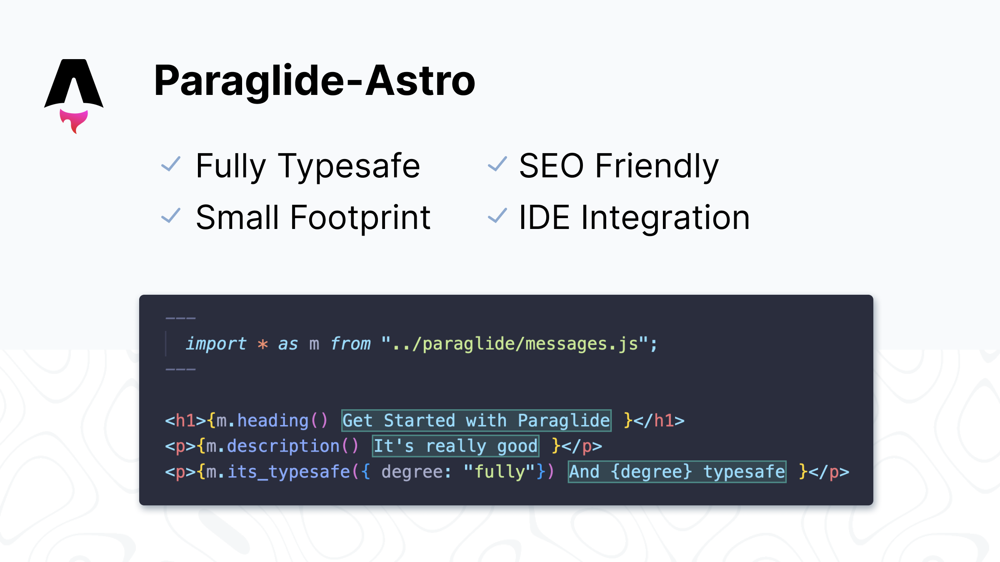

<doc-features>
<doc-feature text-color="#0F172A" color="#E1EFF7" title="Uses astro:i18n for routing" image="https://cdn.jsdelivr.net/gh/opral/monorepo@latest/inlang/packages/paraglide-astro/assets/use-astro-i18n.png"></doc-feature>
<doc-feature text-color="#0F172A" color="#E1EFF7" title="Tiny Bundle Size" image="https://cdn.jsdelivr.net/gh/opral/monorepo@latest/inlang/packages/paraglide-astro/assets/bundle-size.png"></doc-feature>
<doc-feature text-color="#0F172A" color="#E1EFF7" title="Only ships messages used on islands" image="https://cdn.jsdelivr.net/gh/opral/monorepo@latest/inlang/packages/paraglide-astro/assets/islands-only.png"></doc-feature>
</doc-features>

[](https://inlang.com)

# Getting Started 

```bash
npx @inlang/paraglide-js@latest init
npm i @inlang/paraglide-astro
```

This will generate `messages/{locale}.json` files for each of your languages. 

Register the Integration in `astro.config.mjs`:

```js
import paraglideAstro from "@inlang/paraglide-astro"

export default {
	integrations: [
		paraglideAstro({
			project: "./project.inlang",
			outdir: "./src/paraglide",
			// define your strategy
			strategy: ["pathname", "baseLocale"]
		}),
	],
}
```

## Switching the language 

To switch the language, route to the language of interest. For example, to switch to German, route to `/de/page`.

```tsx
<a href="/page">Switch to en</a>
<a href="/de/page">Switch to de</a>
```

You can also use `setLocale` which will redirect the user to page in the given locale. Keep in mind that programmatically setting the locale will ship JS to the client and increase the bundle size.

```ts
import { setLocale } from "../paraglide/runtime.js"

setLocale("de")
```

# Usage

Refer to the Paraglide JS docs https://inlang.com/m/gerre34r/library-inlang-paraglideJs/getting-started.

# Migrating to v1 (beta)

1. Remove references of `Astro.locals.paraglide` from your code in favor of `getLocale()`. If you want to include the dir in the HTML, write your own function. 

```diff
---
+imports { getLocale } from "$paraglide/runtime.js"
---


<!doctype html>
-<html lang={Astro.locals.paraglide.locale} dir={Astro.locals.paraglide.dir}>
+<html lang={getLocale()}>
    <slot />
</html>
```

2. Remove the `astro:i18n` package. Paraglide JS 2.0 has native support for routing.

```diff
// astro.config.mjs

-	i18n: {
-		defaultLocale: "en",
-		locales: ["en", "de"],
-	},
  paraglideAstro({
		// ...
	})

```