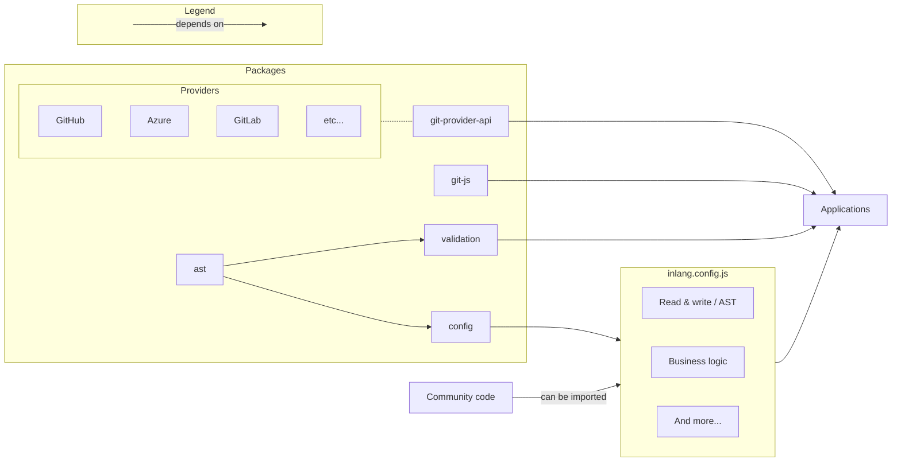

# RFC 001: Foundational Architecture

> In the context of this document, localization (L10n) oftentimes implicitly includes internationalization (i18n). Find a [glossary](#glossary) at the end of this document.

**Inlang's goal** is to streamline software localization for every stakeholder involved to the point that localization is one-click simple.

## Background

Localization of software requires too much effort. Basic tools for developers are missing, translators face Excel spreadsheets, existing solutions are too complicated, and organizations struggle to implement localization. In conclusion: Nobody involved with localization is truly satisfied.

What started with a [proof of concept](https://www.reddit.com/r/sveltejs/comments/p4h6bg/proof_of_concept_internationalize_a_svelte_app_in/) to solve @samuelstroschein's frustrations turned into a year-long research project: "What solution(s) are required to make localization simple across all stakeholders?". Hundreds of interviews and multiple proofs of concepts later a pattern emerged: Software and translations are stored in git. Yet, most solutions do not acknowledge and embrace that fact. Developers manage translations in git while translators manage translations with Excel or [CRUD](https://en.wikipedia.org/wiki/Create,_read,_update_and_delete) UIs on top of databases. Workflows of developers and translators are de-coupled and siloed.

This RFC proposes a localization system that acknowledges git as translation storage and embraces git to close collaboration gaps between developers and translators.

## Scope of this RFC

### Goals

- Define components of which inlang will eventually consist.

- Define a foundational architecture that can be shared among those components.

- Focus on the web platform but keep other platforms (Flutter, iOS, Android) in mind.

### None-goals

- Define detailed architecture of individual components.

## Components

The following components are exposed to users when localizing software: A syntax to express human languages, dev tools, an SDK, automation (CI/CD), and a translation editor (also called CAT).

> A user can either be a translator or developer.


<!-- ```mermaid
flowchart BT
    subgraph Components
      Syntax[Human Language Syntax]
      SDK
      DT[Dev Tools]
      CICD[CI/CD]
      Editor
    end

    Developer---SDK
    Developer---DT
    Developer---Syntax
    Developer---CICD
    Translator---Editor
    Translator---CICD
``` -->

### Human Language Syntax

Expressing plurals, gender, displaying different formats, etc. requires a dedicated syntax to express human languages. Below is an example from Mozilla's Fluent project:

```
example =
    {$userName} {$photoCount ->
        [one] added a new photo
       *[other] added {$photoCount} new photos
    } to {$userGender ->
        [male] his stream
        [female] her stream
       *[other] their stream
    }.
```

```
$userName = Anne
$photoCount = 3
$userGender = female
```

```
Anne added 3 new photos to her stream.
```

Many different syntaxes and formats to store messages exist, even within one ecosystem. The web world has [Unicode's ICU MessageFormat](https://unicode-org.github.io/icu/) and [Mozilla's Fluent](https://projectfluent.org/) project, Apple's iOS uses Localizable Strings, Android uses XML and Flutter uses ARB files. A working group within Unicode has been working on an industry standard that recently [reached stage 1](https://github.com/tc39/proposal-intl-messageformat) called [MessageFormat 2.0](https://github.com/unicode-org/message-format-wg).

#### Observations

1. The sheer variety of syntaxes to express human languages and formats that store them are confusing.
2. Standardization via Unicode's MessageFormat 2.0 is in its infancy.
3. Fluent seems to be the most advanced existing system.

#### Proposal A

Build a "universal" AST on top of MessageFormat 2.0's proposed [spec](https://github.com/unicode-org/message-format-wg/blob/develop/spec/syntax.md). Other syntaxes could be parsed and serialized from and to that AST. By building the AST on top of Message Format 2.0, deeper integrations and features can be built.

**Pros**

- Standardization by leveraging the soon-to-be standard syntax.

- The specification of Message Format 2.0 can be influenced by early feedback from inlang.

**Cons**

- Message Format 2.0 is in its infancy. Breaking changes are to be expected.

#### Proposal B

Build a "universal" AST on top of the [Fluent Project](https://projectfluent.org/) that will evolve into Message Format 2.0. Other syntaxes could be parsed and serialized from and to that AST. By building the AST on top of Fluent, deeper integrations and features can be build.

**Pros**

- Fluent is used in production and takes away many of the features that MessageFormat 2.0 will have. The moment MessageFormat 2.0 is released, support should be trivial.

**Cons**

- Fluent might support features that MessageFormat 2.0 will not support. That could lead to painful migrations or require extensions of MessageFormat 2.0.

- Fluent itself is not widely adopted.

#### Proposal C

Build a "universal" AST that does not heavily lean into a certain syntax and its supported features.

**Pros**

- Whether MessageFormat 2.0, Fluent, or something else becomes the standard does not matter.

**Cons**

- Engineering complexity to support numerous syntaxes.

- Inferior user experience "what syntax supports what?".

- There should not be 10+ different syntaxes to express human languages.

### SDK

Messages (strings) need to be retrieved and formatted. That's the job of an i18n SDK. Most implementations make use of a key-value resource and a lookup function called `t` (translate), or a translation component. From a developer perspective, the i18n SDK loads resources, detects the language of a user, and formats the message. In other words: "The message `example` should be displayed here in the correct language and format for me".

#### Illustration

> Note: The following is a high level overview. Precise implementations and features vary.


##### Resources

```json
{
  "example": "Welcome {$name} to this example.",
  "info": "Click the button to continue."
}
```

##### Retrieving a message

```jsx
import translate from "sdk";

console.log(translate("example", { name: "Samuel" }));
```

##### Output

```
>> Welcome Samuel to this example.
```

#### Observations

1. A variety of good and adopted open source SDKs exist [[1](https://github.com/ivanhofer/typesafe-i18n), [2](https://github.com/formatjs/formatjs), [3](https://pub.dev/packages/flutter_i18n), [4](https://github.com/solidjs-community/solid-primitives/tree/main/packages/i18n), ...]. Each serves a different programming language, framework, niche, or feature.

2. The internals are indentical:  
   `Resource` -> `Reference and Format a Message` -> `Output`

#### Proposal

Leverage existing SDKs instead of forcing a specific inlang SDK.

**Pros**

- Existing codebases can adopt inlang.
- Different SDKs solve different problems.

**Cons**

- The user experience could potentially be higher with a dedicated SDK.

#### Considered alternative

Develop (and require) a dedicated SDK developed by inlang.

**Pros**

- Potentially better user experience by delivering an "end to end" solution.

**Cons**

- Adoption is severely limited.
- Different SDKs exist because a "one size fits all" solution likely does not work.

### Dev tools

Using an SDK does not relieve developers from two extremely time-consuming and ever-repeating tasks:

1. Extracting hard-coded strings.

   Developers have to manually copy & paste hardcoded strings into resources. That process can take weeks.

2. Validating translations.

   No widely adopted tools exist to validate translations: Does the German translation exist? Is the French translation correct? Does the UI work as expected for Arabic?

Furthermore, the DX of localizing software, in general, is improvable. The pseudocode below illustrates some problems:

```jsx
import translate from "i18n-sdk";
import Translated from 'i18n-sdk';

// What is info referring to?
<p>{translate('info')}</p>

// 1. Ugh ... do I need to wrap every element in a Translated component now?
// 2. Okay, I see what `info` is referring to now, but
//    changing the text "Click the button..." will not
//    be reflected in the resource! I still have to manually
//    edit the resource file!
<Translated id="info">
  <p>Click the button to continue.</p>
</Translated>
```

> At this point you might be wondering why the text "Click the button to continue." itself is not used as key/id. The reasons stems from changing the text and thereby losing the connection to the translations or invalidating them. The Fluent project explained their rationale of using ids [here](https://github.com/projectfluent/fluent/wiki/Fluent-vs-gettext#translation-invalidation).

#### Observations

1. Dev tools beyond SDKs are required to make localization effortless.

2. A CLI to extract and validate messages enables CI/CD.

3. Platform-specific tooling like GitHub actions can be built on top of dev tools (the CLI).

4. An [IDE extension](https://marketplace.visualstudio.com/items?itemName=inlang.vs-code-extension) speeds up development.

<br/>
<figure>
  
  <figcaption>
    <small>
      An IDE extension speeds up development by an order of magnitude.   
    </small>
  </figcaption>
</figure>


#### Proposal

Develop a CLI and VSCode extension to extract and validate resources and messages.

### Editor

Translators need a dedicated editor to manage translations. Those editors exist and are called CAT (Computer Assisted Translation) editors. However, they add complexity by requiring continuous synchronization between git repositories and remote databases.

#### Observations

1. Databases that store translations are overhead. Git repositories already store translations.

2. Git (including GitHub and GitLab) provides version control, collaboration, and an awesome review system. All of which are required for a CAT editor.

<br/>
<figure>
  
  <figcaption>
    <small>
      Early iteration of the CAT editor.   
    </small>
  </figcaption>
</figure>


#### Proposal

Develop a CAT editor that combines VSCode and Figma. VSCode brings out-of-the-box git and local file support while Figma brings ease of use to the table by running in the browser. A working proof of concept can be found [here](https://inlang-web-app-demo-5kw9a.ondigitalocean.app/git/https://github.com/inlang/demo/in-editor).

**Pros**

- Leverage git workflows and features.
- Easy adoption (just like [vscode.dev](https://vscode.dev)).
- Not requiring a server: Synchronization pipelines are not required.
- Not requiring a server: No lock-in. Translations are not stored and therefore not owned by inlang (enables CI/CD).

**Cons**

- Engineering effort: Git is not meant to build applications on top off and to be run in the browser.

- Design effort: Git is difficult to understand. Abstractions for translators need to be designed.

- Not requiring a server: Open source monetization through hosting is difficult, if not impossible.

### Automation (CI/CD)

The hand-off between developers and translators requires automation. The current status quo of manual pinging is unbearable.

#### Observations

1. Every (software) company already has an automation solution in the form of CI/CD.

2. Since localization is tightly coupled with software development, existing CI/CD infrastructure can be used instead of building out (and forcing) another automation layer.

#### Proposal

Leverage existing CI/CD infrastructure that is built on top of git like CircleCI, GitHub actions, and GitLab.

**Pros**

- Easier adoption of inlang as a suite by not forcing the adoption of a dedicated automation layer.
- The dev tools can be leveraged for automation.

**Cons**

- Monetizing automation becomes harder. CI/CD infrastructure providers make the money.

## Architecture

The following describes a foundational architecture that is designed to support the components defined above while sharing as much code and business logic as possible.

Interestingly, only two questions need to be elaborated, and both go hand-in-hand:

1. How are messages (translations) stored?
2. How are components configured and orchestrated?

### Where are messages stored?

The common pattern across larger projects is to store messages in dedicated resource files.

The pattern is easy to implement: Only the paths of the files need to be known. A string-based config is sufficient to implement read and write operations by parsing and serializing the resource files.

_Dedicated resource files pattern:_

```
.
├── resources/
│   ├── de.ftl
│   └── en.ftl
├── App.jsx
└── inlang.config.json
```

_Examplary inlang config:_

```json
{
  "pathPattern": "./resources/{languageCode}.ftl"
}
```

However, smaller projects store messages directly in code [[1](https://github.com/ivanhofer/typesafe-i18n), [2](https://github.com/Divine-Software/divine-companions/tree/master/localization), [3](https://github.com/solidjs-community/solid-primitives/tree/main/packages/i18n)]. The motivation behind storing messages in code is the ease of implementation and use.

#### Proposal

Be unopinionated where and in which format messages are stored to allow adoption of inlang among smaller projects. This directly leads to the configuration question: "How can inlang be unopinionated while requiring reading and writing to resources?".

### How is inlang configured?

Using JavaScript as a configuration format would allow unopinionated workflows. Developers are empowered to adjust inlang, across every component, to their needs. The read and write problem of resources could be solved by exposing `readResources` and `writeResources` as callbacks in a config file. Furthemore, JavaScript as config solves two common config file annoyances. First, comments are supported (looking at you JSON) and type annotations via JSDoc/TypeScript enable autocomplete and typesafety.

**Flowchart of JS as config**


**Pseudocode inlang config**

```js
export function readResources(filesystem) {
  // developers can specify how resources
  // are read from the source code/files.
  const resources = filesystem.readFile(...)
  return resources;
}

export function writeResources(filesystem, resources) {
  // developers can specify how resources
  // are written to the source code/files.
  filesystem.writeFile(resources)
}

// The config can also be used to export
// variables or objects.
export const metadata = {
  language: "DE",
}

```

One (the?) drawback of JS as config is exploit vulnerability. The JS config could contain malicious code that would be executed by inlang components. An example exploit: An attacker could steal user authentification information by writing malicious code in the config that reads authentification information from the editor. JS as config would require sandboxing to a certain degree to eliminate exploit vulnerability.

### Sandboxing the config

The config architecture of inlang is similar to Figma's plugin system. Figma allows developers to write plugins in JavaScript that are executed in the browser, similar to inlang's desire to execute config code in the browser. [This article](https://www.figma.com/blog/how-we-built-the-figma-plugin-system/) on Figma's blog goes into great length on different sandboxing approaches and trade-offs. Figma initially chose the [Realms shim developed by Agoric](https://github.com/agoric/realms-shim/). The Agoric Realms approach was eventually compromised and Figma switched to a [WebAssembly-based JavaScript runtime](https://bellard.org/quickjs/).

The design requirement for inlang are as follows:

- Eliminate malicious attacks that have impact beyond inlang components.
  A DOS (Denial of Service) attack by, for example, blocking the main thread via `while (true)` would be okay since it affects only a component itself and poses no harm outside of an app becoming unresponsive. Being able to access auth tokens stored in cookies via the global `window` variable in browsers could be devastating though.

- Support ES Modules (ESM) to consume exported functions and variables on demand. Executing a config similar to `eval` is not of interest.

- Execute async code. The filesystem API and other APIs are more readbale with an async API and will not block the main thread.

- Support the import of external scripts/packages. The flexibility of defining `readResources` and `writeResources` is handy but the ability to import third party code that deals with reading and writing resources reduces the adoption friction.

In response to the Realms shim compromise, Agoric designed the [SES (Secure ECMAScript)](https://github.com/endojs/endo/tree/master/packages/ses) proposal.

### Flowchart



#### git-provider-api

Git (hosting) providers add features on top off git like pull or merge requests and handle authoriziation differently. The `git-provider-api` provides one API that deals with the API differences between hosting providers.

#### validation

The `validation` package validates resources and messages based on the AST and can be used to further build on top.

#### git-js

Git will be run in JS environments (browser and node). A package is required to make that work. Luckily, [isomorphic git](https://github.com/isomorphic-git/isomorphic-git) provides a base version.

#### ast

Defines the AST (abstract syntax tree) that every component, and hence inlang overall, builds upon.

#### config

Defines the config schema(s) and provides types and utility functions to create a config.

#### Community packages

The JS inlang config file is supposed to be able to import external code. By providing import functionality, read, write and business logic functions can be shared.

---

## Glossary

### Inlang

Inlang is the project and product name. Inlang stands for "_**in**_ your _**lang**_(uage)".

### Locale

Locale refers to a language or country. A more suitable name would probably be demographic. Think of speaking different languages (German, English, Dutch) and/or living in different locations (Germany, US, UK, India).

### Internationalization (i18n)

Internationalization refers to the engineering effort of ensuring that an app can be localized (display content in different languages) and behaves correctly in different locales.

i18n = developers work.

### Localization (L10n)

Localization is the act of translating a piece of software into multiple languages, including its assets (images, videos, etc.).

l10n = translators work.

### Message

The basic unit of translation is called a message. Messages are containers for information. Messages are used to identify, store, and recall translation information to be used in the product [[source](https://projectfluent.org/fluent/guide/hello.html)].
