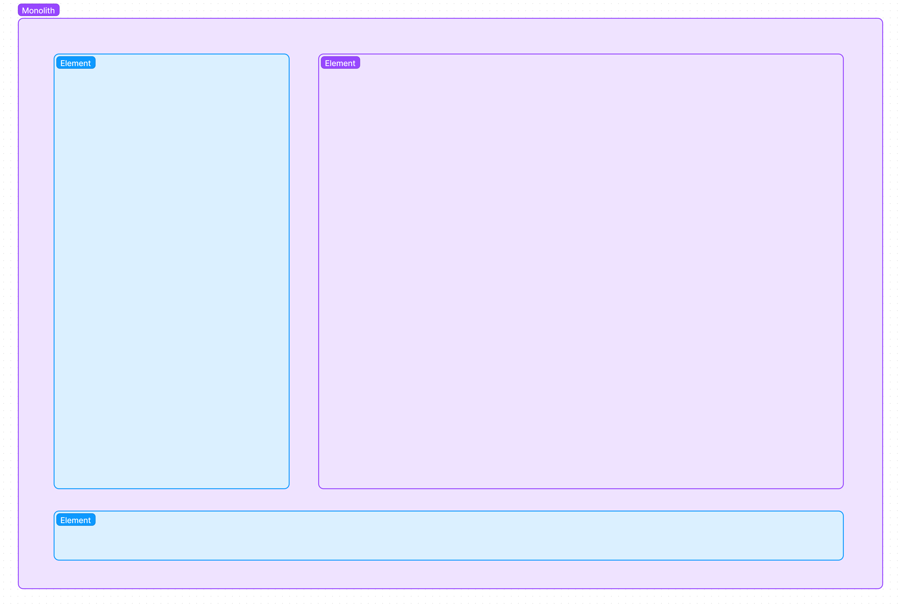

### 💡 Discuss the RFC [here](https://github.com/inlang/inlang/pull/128).

# RFC 002: Tech Stack and Architecture of the editor + website

## TL;DR

Simplicity and control over feature-rich but complex off the shelf solutions.

Importance of long-term maintainability, development velocity, and the possiblity to [dogfood](https://en.wikipedia.org/wiki/Eating_your_own_dog_food) is valued higher than faster short-term development velocity.

Architecture: Monolith
Framework: [SolidJS](https://www.solidjs.com/)
Metaframework: [Vite Plugin SSR](https://vite-plugin-ssr.com/)
Design system: [Tailwind](https://tailwindcss.com/) + [Zag.js](https://zagjs.com/)
Markdown: [Markdoc](https://markdoc.dev/)

## Scope of this RFC

### Goals

- Define architectural requirements.
- Choose a front-end framework.

### None-goals

- Define small features of the editor that can be implement regardless of the architecture.

## Requirements

> **Legend**
>
> ✅ = yes  
> ❔ = maybe in the future  
> ❌ = no

- Git integration ✅
- One-click "ready to use" ✅
- Compatible with local and remote files ✅

The requirements above resemble a fusion of VSCode and Figma. VSCode due to the tight git integration that localization of software requires, and Figma due to the browser-based architecture. Figma does not need to be downloaded, installed and opened. Open a link in the browser and get started. A similar "one click ready to use" experience is desired for the inlang editor. VSCode recently released their effort to bring VSCode into the browser, see https://vscode.dev/. VSCode.dev brings another feature that the inlang editor requires: Local repositories and remote repositories can be used. Local repositories would allow developers to easily use the inlang editor while remote repositories make life easy for translators.

- Real-time collaboration ❔

Git's async collaboration features are deemed to be sufficient. Product usage and feedback will reveal whether real-time collaboration is benefitial and desired.

- Embeddable ❌

Integrating the editor into an IDE or text editor like VSCode could streamline the experience for developers. On the other hand, the requirement of the editor to work with local files reduces the benefit of an IDE integration. Offline support could be achieved by leveraging PWA (Progressive Web Application) features. The majority of professional content related applications like Google Docs, VSCode or Figma (all?) are architected as dedicated applications, illustrated by figure _(b)_.

Reasons against embeddability are runtime dependent features like networking or sandboxing JavaScript. However, the inlang config already delegates those requirements out of the editor. A network request would be required for machine translations for example. But, the inlang config could contain a callback `onMachineTranslate`. The host would be responsible for making the network request.

|            | Development speed | Maintenance effort | Potential extension |
| ---------- | ----------------- | ------------------ | ------------------- |
| Monolith   | +                 | +                  | o                   |
| Separated  | o                 | o                  | o                   |
| Embeddable | -                 | o                  | +                   |

<figure>
    
</figure>

<figure>
    
    <figcaption>
        (a) Monolith architecture. Non-editor related and editor related elements are co-developed in one application/source code.
    </figcaption>
</figure>

<figure>
    
    <figcaption>
        (b) Separated architecture. A website or app links to a separate application: <i>inlang.com</i> -> <i>editor.inlang.com</i>. Similar to clicking on a document in Google Drive. The click forwards from <i>drive.google.com</i> to another app <i>docs.google.com</i>. 
    </figcaption>
</figure>

<figure>
    
    <figcaption>
        (c) Embedded architecture. Host applications like inlang.com or VSCode embed the editor. 
    </figcaption>
</figure>

- SPA, SSR, MPA, (PWA)

The editor is a classical SPA while the website is SSR.

- SEO ✅ (website) ❔ (editor)

SEO is important for the website and might be important for the editor.

## Choices

A monolith architecture has been chosen. The website and editor are co-developed in one codebase to increase development speed and reduce maintenance effort.

Framework: [SolidJS](https://www.solidjs.com/)
Metaframework: [Vite Plugin SSR](https://vite-plugin-ssr.com/)
UI components: [Tailwind](https://tailwindcss.com/) + [Zag.js](https://zagjs.com/)

### website (metaframework)

Control over the website is required to localize the website at some point. Website builders like Webflow support no localization.

#### why vite-plugin-ssr?

- Unify routing, auth, SEO of editor and website
- Control over different rendering modes (important because SSR of website and SPA of editor)
- Simple, no black box like a complete meta framework.
- Configure localization as we please

#### why not nextJS?

- Unify editor and website codebase + routing
- NextJs is not made for SPA apps

### editor (metaframework)

#### why vite-plugin-ssr?

- Unify routing, auth, SEO of editor and website
- Maybe SEO becomes important (architecture can be adjusted to support SSR)

#### Why not react router for the editor?

- Routing and auth will differ from website
- (No SSR, if SEO becomes important)

## design system (ui library)

### framework

Vite-plugin-ssr is used across the website and editor. Thus, the hard requirement for React does not exist, opening the opportunity the evaluate other frameworks.

#### why solidjs?

- Simple + built-in state management.
  - faster product development
  - better maintainability
- Uses the platform (web components, native JS packages work)
- Uses JSX, thereby synergy effects to React (worst case, switch to React is possible)
- Runtime approach (compiler just transforms JSX)
  - Reactivity works in plain JS, in contrast to Svelte, leading to less workarounds
- performance “for free”.
  - Performance is likely important for the editor.
- (Great documentation -> understandable for beginners)

#### why not react?

- Anticipated slower development speed and higher maintainability effort.
  - De-coupled state management
  - Performance optimization needs to be conducted manually (likely important for the editor)

#### why not svelte?

- No JSX
  - Requires custom ide extensions for .svelte files
  - not compatible with anything JSX
- Typescript is a second-class citizen (partially because not compatible with JSX)
- Syntax is nice but compiled output harder to grasp compared to SolidJS
  - (Better debugging of SolidJS)
- State management is inferior to SolidJS
  - For example, async fetching of data
  - State can only be used in Svelte components, otherwise workarounds are required.

## design system

TailwindCSS + ZagJS. TailwindCSS provides fast styling and ZagJS provides fast component logic (that works with SolidJS). Both solutions are headless. A headless solution provides the possibility to incrementally develop our own design system over time instead of fighting pre-designed component libraries.

## markdown

### Why [Stripe's Markdoc](https://markdoc.dev/)?

Simplicity. Markdoc is "just" a markdown parser with customizable validation. The AST can be used to render the markdown and custom components.

- simple and customizable
- built-in validation for custom tags
- can be used to render interactive components like MDX (if required)
- portable because plain markdown + own renderer, not compiling to javascript like mdx

### Why not MDX?

- compiling to javascript complicates things
- dependent on javascript runtime (less portable)
