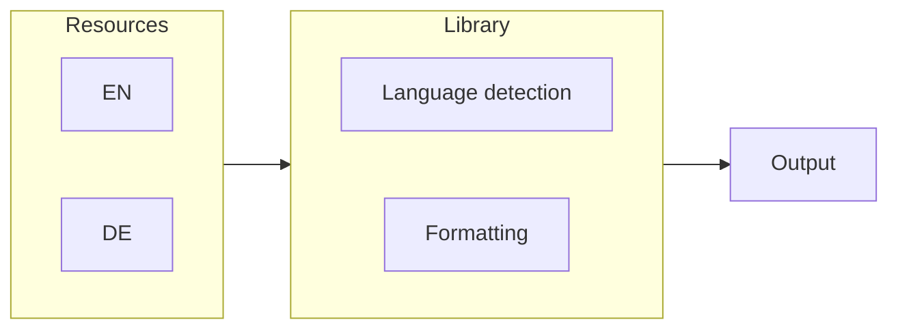
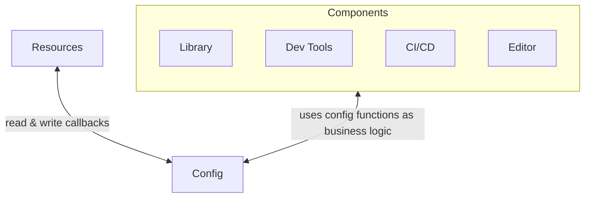
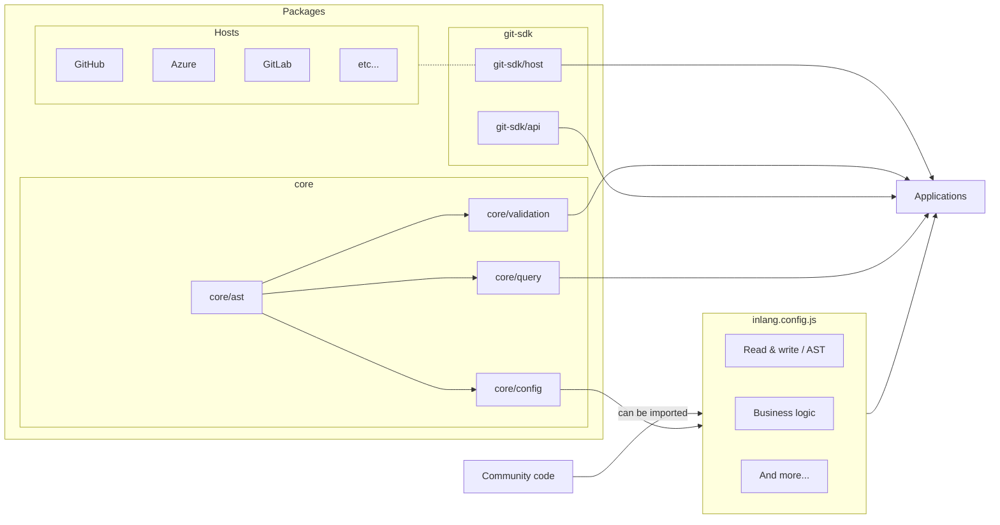

---
# the frontmatter is only relevant for rendering this site on the website
title: Core architecture
href: /blog/rfc-core-architecture
description: This RFC describes the architecture of inlang.
---

### 💡 Discuss the RFC [here](https://github.com/opral/inlang/pull/127).

# RFC 001: Core Architecture

> In the context of this document, localization (L10n) oftentimes implicitly includes internationalization (i18n). Find a [glossary](#glossary) at the end of this document.

**Inlang's first goal** is to make software localization easier for every stakeholder (developers, translators, product managers). We believe that localization is underutalized, and if the effort to localize is just low enough, the majority of projects and organizations will localize.

**Inlang's second goal** might become the provision of infrastructure to build apps with built-in version control and automation. Whereas the first app to be build on such infrastructure is inlang itself.

## Background

Localization of software requires too much effort. Basic tools for developers are missing, translators face Excel spreadsheets, existing solutions are too complicated, and organizations struggle to implement localization. In conclusion: Nobody involved with localization is truly satisfied.

What started with a [proof of concept](https://www.reddit.com/r/sveltejs/comments/p4h6bg/proof_of_concept_internationalize_a_svelte_app_in/) to solve @samuelstroschein's frustrations turned into a year-long research project: "What solution(s) are required to make localization simple across all stakeholders?". Hundreds of interviews and multiple proofs of concepts later a pattern emerged: Software and translations are stored in git. Yet, most solutions do not acknowledge and embrace that fact. Developers manage translations in git while translators manage translations with Excel or [CRUD](https://en.wikipedia.org/wiki/Create,_read,_update_and_delete) UIs on top of databases. Workflows of developers and translators are de-coupled and siloed.

This RFC proposes a localization system that acknowledges git as the single source of truth, utilizes git for automation, and extends git to close collaboration gaps between developers and translators.

In short, a git-based localization system for developers and translators with a high degree of composability and automation.

<br/>
<figure>
  
  <figcaption>
    <small>
      A git-based localization system enables seamless collaboration between developers and translators with endless automation possibilities.
    </small>
  </figcaption>
</figure>


## Scope of this RFC

### Goals

- Define components of which inlang will eventually consist.
- Define a core architecture that can be shared among those components.
- Focus on the web platform but keep other platforms (Flutter, iOS, Android) in mind.

### None-goals

- Define the detailed architecture of individual components.

## Components

The following components are exposed to users when localizing software: A syntax to express human languages, dev tools, an i18n library, automation (CI/CD), and a translation editor (also called CAT).

> A user can either be a translator or developer.


### Human Language Syntax

Expressing plurals, gender, displaying different formats, etc. requires a dedicated syntax to express human languages. Below is an example from Mozilla's Fluent project:

```
example =
    {$userName} {$photoCount ->
        [one] added a new photo
       *[other] added {$photoCount} new photos
    } to {$userGender ->
        [male] his stream
        [female] her stream
       *[other] their stream
    }.
```

```
$userName = Anne
$photoCount = 3
$userGender = female
```

```
Anne added 3 new photos to her stream.
```

Many different syntaxes and formats to store messages exist, even within one ecosystem. The web world has [Unicode's ICU MessageFormat](https://unicode-org.github.io/icu/) and [Mozilla's Fluent](https://projectfluent.org/) project, Apple's iOS uses Localizable Strings, Android uses XML and Flutter uses ARB files. A working group within Unicode has been working on an industry standard that recently [reached stage 1](https://github.com/tc39/proposal-intl-messageformat) called [MessageFormat 2.0](https://github.com/unicode-org/message-format-wg).

The sheer amount of syntaxes is overwhelming for users and localization providers alike. Users need to learn different syntaxes and localization providers need to support those syntaxes. While one standard syntax to express human languages should be the end goal, for the sake of adoption, inlang should support a variety of syntaxes.

Supporting different syntaxes and their features opens the question of how the AST, that powers every other component, is designed: Leverage an existing AST of a specific syntax? Design a custom AST? Regardless of the answer, other formats must be parsed to that AST and serialized back to the initial format (round-trip).

#### Observations

- The sheer variety of syntaxes to express human languages is confusing.
- Standardization via Unicode's MessageFormat 2.0 is in its infancy.
- Supporting different syntaxes now is beneficial for adoption but standardization is beneficial and should be accounted for.
- Fluent seems to be the best-designed syntax used in production.
- Existing AST's are not designed for consumption, not for applications.

#### Decision

Develop a custom AST that is inspired by Fluent and the upcoming MessageFormat 2.0 spec. During prototyping the observation has been made that inlang will most likely require custom AST nodes and thereby deviate from existing designs in any case. Most ASTs are designed for consumption rather than applications. Some ASTs like Fluent also impose numerous features that would have to be supported albeit the benefit and future is unclear. A good example are [Terms](https://projectfluent.org/fluent/guide/terms.html).

### i18n Library

Messages need to be retrieved and formatted. That's the job of an i18n library. Most implementations make use of a key-value resource and a lookup function called `i` (inlang), or a translation component. From a developer's perspective, the i18n library loads resources, detects the language of a user, and formats the message. In other words: "The message `example` should be displayed here in the correct language and format for me".

#### Illustration

> Note: The following is a high level overview. Precise implementations and features vary.



##### Resources

```json
{
  "example": "Welcome {$name} to this example.",
  "info": "Click the button to continue."
}
```

##### Retrieving a message

```jsx
import translate from "i18n-library";

console.log(translate("example", { name: "Samuel" }));
```

##### Output

```
>> Welcome Samuel to this example.
```

#### Observations

1. A variety of good and adopted open source libraries exist [[1](https://github.com/ivanhofer/typesafe-i18n), [2](https://github.com/formatjs/formatjs), [3](https://pub.dev/packages/flutter_i18n), [4](https://github.com/solidjs-community/solid-primitives/tree/main/packages/i18n), and more]. Each serves a different programming language, framework, niche, or feature.

2. The internals are identical:
   `Resource` -> `Reference and Format a Message` -> `Output`

#### Decision

Leverage existing i18n libraries instead of forcing a specific inlang library.

##### Pros

- Already localized codebases can easily adopt inlang.

  Localized codebase use i18n libraries, or custom build solutions. By being i18n library agnostic, those codebases are not required to migrate to a library provided by inlang. Instead, inlang complements the existing library or solution in use.

- Different libraries have different design goals and trade-offs.

  One library to rule them all is unlikely a feasible idea. Applications have different requirements. For example, different rendering techniques alone (client side vs server side) lead to different localization requirements. Furthermore, some languages and frameworks such as Apple's Swift language support localization out of the box, making the requirement for a (basic) i18n library obsolete. Supporting native localization features instead of forcing the use of an i18n library is arguably better. And so is supporting a suited localization approach, i.e. different i18n libraries, better than forcing the usage of a specific, but less suited, i18n library onto developers.

##### Cons

- The user experience could potentially be higher with a dedicated library.

#### Considered alternative

Develop (and require) a dedicated library developed by inlang.

##### Pros

- Potentially better user experience by delivering an "end to end" solution.

##### Cons

- Adoption is severely limited.
- Different libraries exist because a "one size fits all" solution likely does not work.

### Dev tools

Using a library does not relieve developers from two extremely time-consuming and ever-repeating tasks:

1. Extracting hard-coded strings.

   Developers have to manually copy & paste hardcoded strings into resources. That process can take weeks.

2. Validating messages.

   No widely adopted tools exist to validate messages: Does the German message exist? Is the French message correct? Does the UI work as expected for Arabic?

Furthermore, the DX of localizing software, in general, is improvable. The pseudocode below illustrates some problems:

```jsx
import translate from "i18n-library";
import Translated from 'i18n-library';

// What is info referring to?
<p>{translate('info')}</p>

// 1. Ugh ... do I need to wrap every element in a Translated component now?
// 2. Okay, I see what `info` is referring to now, but
//    changing the text "Click the button..." will not
//    be reflected in the resource! I still have to manually
//    edit the resource file!
<Translated id="info">
  <p>Click the button to continue.</p>
</Translated>
```

> At this point you might be wondering why the text "Click the button to continue." itself is not used as key/id. The reasons stems from changing the text and thereby losing the connection to the translations or invalidating them. The Fluent project explained their rationale of using ids [here](https://github.com/projectfluent/fluent/wiki/Fluent-vs-gettext#translation-invalidation).

#### Observations

- Dev tools beyond i18n libraries are required to make localization effortless.
- A CLI enables developers to build custom CI/CD pipelines.
- Platform-specific tooling like GitHub actions can be built on top of dev tools (the CLI).
- An [IDE extension](https://marketplace.visualstudio.com/items?itemName=inlang.vs-code-extension) speeds up development.

#### Decision

Develop a CLI and Visual Studio Code extension (Sherlock) to extract and validate resources and messages.



### Editor



Translators need a dedicated editor to manage translations. Those editors exist and are called CAT (Computer Assisted Translation) editors. There are two types of editors:

1. Local single-user editors such as [MemoQ](https://docs.memoq.com/current/en/Images/m-q/project-home-translations-tpro-documents-structure.png).
2. Cloud based editors like [Lokalise, [Smartling](https://www.smartling.com/), or [Transifex](https://www.transifex.com/).

Single-user editors are displaced by cloud-based editors for _simple_ string localization such as software. Collaboration is easier with a cloud-based solution. However, cloud-based editors add complexity by requiring continuous synchronization with the source code (git repository) and _the_ cloud; thereby breaking the single source of truth contract.

#### Observations

- The cloud is overhead. Git repositories are built for collaboration and store translations.

- Git (including GitHub and GitLab) provides version control, collaboration, and an awesome review system. All of these are required for a CAT editor essentially _for free_.

#### Proposal

A git-based editor that combines the collaboration of cloud-based solutions with the simplicity of a local-first solution. Think of a combination of Figma and Visual Studio Code: Visual Studio Code brings out-of-the-box git and local file support while Figma brings ease of use to the table by running in the browser. A working proof of concept can be found [here](https://inlang-web-app-demo-5kw9a.ondigitalocean.app/git/https://github.com/inlang/demo/in-editor).

##### Pros

- Leverage git workflows and features.
- Easy adoption (just like [vscode.dev](https://vscode.dev)).
- Not requiring a server: Synchronization pipelines are not required.
- Not requiring a server: No lock-in. Translations are not stored and therefore not owned by inlang (enables CI/CD).

##### Cons

- Engineering effort: Git is not meant to build applications on top off and to be run in the browser.
- Design effort: Git is difficult to understand. Abstractions for translators need to be designed.

### Automation (CI/CD)

The hand-off between developers and translators requires automation. The current status quo is either no automation or limited automation via cloud-based solutions.

#### Observations

- Every (software) company already has an automation solution in the form of CI/CD.
- Since localization is tightly coupled with software development, existing CI/CD infrastructure can be used instead of building out (and forcing) another automation layer.

#### Proposal

Leverage existing CI/CD infrastructure that is built on top of git like CircleCI, GitHub actions, and GitLab.

##### Pros

- Easier adoption of inlang as a suite by not forcing the adoption of a dedicated automation layer.
- The dev tools can be leveraged for automation.

##### Cons

- No GUI (Graphical User Interface) - but also no GUI limitation of expressiveness.
- Relying on external CI/CD infrastructure.

## Architecture

The following describes a core architecture that is designed to support the components defined above while sharing code and business logic. Interestingly, only two questions need to be elaborated, and both go hand-in-hand:

1. How are messages stored?
2. How are components configured to work hand-in-hand?

### 1. How are messages stored?

The common pattern across larger projects is to store messages in dedicated resource files. The pattern is easy to implement: Only the paths of resource files need to be known. A string-based config is sufficient to implement read and write operations by parsing and serializing the resource files.

_Dedicated resource files pattern:_

```
.
├── resources/
│   ├── de.ftl
│   └── en.ftl
├── App.jsx
└── project.inlang.json
```

_Exemplary inlang config:_

```json
{
  "pathPattern": "./resources/{languageCode}.ftl"
}
```

However, smaller projects store messages directly in code [[1](https://github.com/ivanhofer/typesafe-i18n), [2](https://github.com/Divine-Software/divine-companions/tree/master/localization), [3](https://github.com/solidjs-community/solid-primitives/tree/main/packages/i18n)]. The motivation behind storing messages in code is the ease of implementation and use.

#### Proposal

Be unopinionated where and in which format resources are stored and thereby ease adoption. Being unopinionated directly leads to the configuration question: "How can inlang be unopinionated while requiring reading and writing to resources?".

### 2. How is inlang configured?

Using JavaScript as a configuration format would allow unopinionated storing of resources. The read and write problem of resources could be solved by exposing `readResources` and `writeResources` as callbacks in a config file. Developers are empowered to adjust those functions, and more, to their needs. Furthermore, JavaScript as config solves two common config file annoyances. First, comments are supported, and type annotations via JSDoc/TypeScript enable autocomplete and type safety.

**Flowchart of JS as config**



**Pseudocode inlang config**

```js
export function readResources(filesystem) {
  // developers can specify how resources
  // are read from the source code/files.
  const resources = filesystem.readFile(...)
  return resources // as AST;
}

export function writeResources(filesystem, resources) {
  // developers can specify how resources
  // are written to the source code/files.
  filesystem.writeFile(resources)
}

// The config can also be used to export
// variables or objects.
export const metadata = {
  language: "DE",
}

```

One (the?) drawback of JS as config is security. The JS config could contain malicious code that would be executed by inlang components. An example exploit: An attacker could steal user authentification information by writing malicious code in the config that reads authentification information from the editor. JS as config would require sandboxing to a certain degree to eliminate exploit vulnerability.

#### Proposal

Leveraging JavaScript, or any programming language allows for tremendous flexibility and therefore unopinionated workflows. Flexibility is required: Codebases differ, approaches to localize software differ, syntaxes differ, and last but not least workflows differ. JavaScript as config could even be used to adjust the business logic of components:

```js
// pseudocode that illustrates the possbility to
// adjust how messages are machine translated.
export async function onMachineTranslate(message) {
  // or DeepL, Yandex, etc.
  const googleTranslate = await import("google-translate");
  return googleTranslate(message);
}

// pseudocode that illustrates the possiblity to adjust
// the business logic of the editor.
export const editor = {
  // what should happen when a translator pressed "Save"
  // (edited a message).
  onSave: async (message) => {
    // the message could be committed.
    return commit(message);
    // or a pull request can be opened.
    return openPullRequest(message);
    // or something else can happen
    return somethingElse(message);
  },
  // and more...
};
```

### Conclusion

The common denominator across all proposed components is a JavaScript [instead of JSON/YAML/TOML] config and an AST. Hence, the core architecture is a config and AST package that is consumed by every other component of inlang.

The JS config solves the storage [of resources] and different syntaxes [to express human languages] problems. Developers can define how resources are read, parsed, serialized, and written to the filesystem. Furthermore, developers are empowered to adjust the business logic of inlang components to the needs of the project. Due to the complexity of sandboxing JS, the detailed design of the config will follow in RFC-003.

The config itself requires an AST specification for developers to parse resources to and serialize from which is further consumed by all inlang components. TODO: THE CHOICE HAS NOT BEEN MADE YET.

### Dependency graph

The `ast` and `config` packages are the core components that power inlang. The `ast` is used to act on resources whether it be CRUD operations or validation. The `config` package defines a schema (functions) that the `inlang.config.js` file implements. Among those functions is defined how resources are read, parsed to an AST, serialized from an AST, and written to the file system. Hence the dependency of `config` to `ast`. Furthermore, `config` provides sandboxing to import and securely execute the implemented code.



#### git-sdk

The SDK to build applications on top off git.

##### git-sdk/api

Git will be run in JS environments (browser and node). [isomorphic git](https://github.com/isomorphic-git/isomorphic-git) provides a base version that is likely fast enough. If not, a switch to a wasm version of [libgit2](https://libgit2.org/) should be possible. In any case, git is a CLI and not an SDK. We expect to extend git substiantally as the requirements evolve.

##### git-sdk/host

Git (hosting) providers (hosts) add features on top of git like pull or merge requests and handle authorization differently. The `git-sdk/host` provides one API that deals with the API differences between hosting providers.

#### core

The core components and packages that depend on the AST.

##### core/ast

Defines the AST (abstract syntax tree) that every component, and hence inlang overall, builds upon.

##### core/validation

Validates resources and messages based on the AST and can be used to further build on top.

##### core/config

Defines the config schema(s) and provides types and utility functions to create a config.

#### Community code

The JS inlang config file is supposed to be able to import external code. By providing import functionality, read, write and business logic functions can be shared.

---

## Glossary

### Inlang

Inlang is the project and product name. Inlang stands for "_**in**_ your _**lang**_(uage)".

### Component

A component in the context of this RFC is either an application or a package. An application is usually broken down into multiple packages.

### Locale

Locale refers to a language or country. A more suitable name would probably be demographic. Think of speaking different languages (German, English, Dutch) and/or living in different locations (Germany, US, UK, India).

### Internationalization (i18n)

Internationalization refers to the engineering effort of ensuring that an app can be localized (display content in different languages) and behaves correctly in different locales.

i18n = developers work.

### Localization (L10n)

Localization is the act of translating a piece of software into multiple languages, including its assets (images, videos, etc.).

l10n = translators work.

### Message

The basic unit of translation is called a message. Messages are containers for information. Messages are used to identify, store, and recall translation information to be used in the product [[source](https://projectfluent.org/fluent/guide/hello.html)].

### Resource

A collection of messages. Think of a file or object containing multiple messages.
