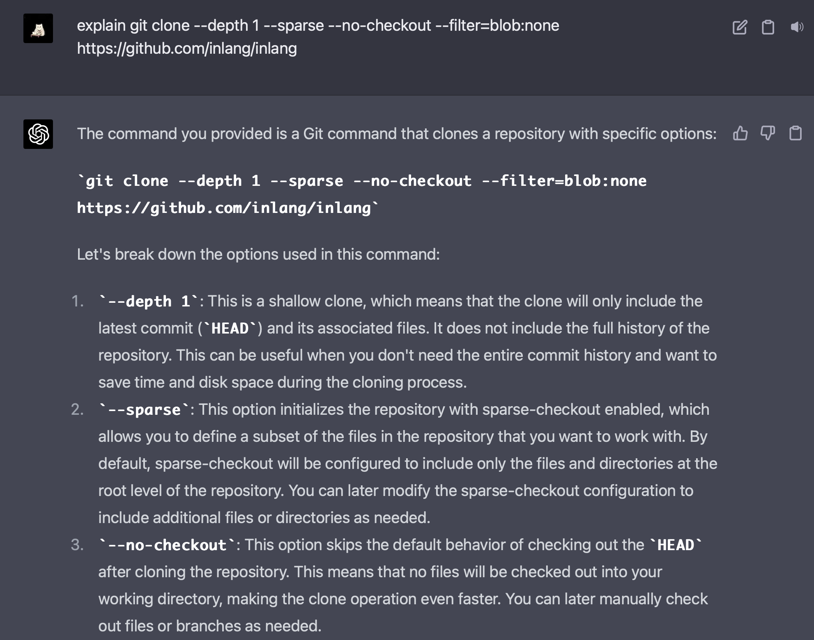
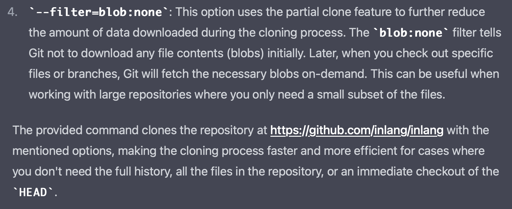

# RFC git sdk requirements

## Background

This RFC evaluates two architectures on building a git backend that serves current and foreseen needs of inlang.

The inlang editor currently uses the git JS implementation. The JS implementation lacks git features that are required to build out the editor. The lack of git features triggered the exploration of switching the underlying git implementation, see [https://github.com/inlang/inlang/issues/278](https://github.com/inlang/inlang/issues/278).

### Glossary

- **isomorphic git** -The JavaScript git implementation currently used in the inlang editor.
- **libgit2** - The git implementation that can be compiled to WebAssembly.
- **git-sdk** - Client side git implementation that takes over cloning a repository.
- **git-server** - Server that host git repositories. Think of GitHub.

## Goals

- Focus on iteration speed.
  - We deal with high uncertainty. The faster we can iterate, the better we can react to changing requirements.
- Focus on DX when using the SDK.
  - How easy can developers use the git backend? We intend to offer version control as a backend to external developers.
- The implementation must be de-coupled from inlang.
  - Inlang provides requirements that are _most likely_ universal across apps that build on git. But, the git-sdk should be de-coupled from inlang to enable developers to use the sdk to build own apps.

## Non-goals

- Architect the perfect system based on currently known requirements.
  - The requirements will change. We can’t architect the perfect system now.

## Requirements

### Must run in the browser/on the client [High Confidence]

Solving git limitations client-side, in the git-sdk, simplifies application architectures and is large part of inlang’s “the next git” thesis.

Problems we are running into are identical on both the server and client. For example, reducing the bandwidth/time to clone a repository: Moving git-sdk logic to the server only shifts the problem to the server, but doesn’t solve it. The client would need to wait for the server to finish cloning of the repositories. Instead, the git-sdk can be adjusted to support lazy loading of files and thereby automatically solve long cloning times client- and server side.

### Lazy loading of files and git history [High Confidence]

Oftentimes only a subset of files in git repositories are required. Only cloning files and their history that is needed substantially reduces network and storage requirements. A lazy loading solution is likely coupled with the filesystem implementation.

```jsx
/**
 * An example lazy loading implementation API.
 */

// does not clone the entire repository.
// only metadata that enable other git commands to run
await clone("https://github.com/inlang/inlang", fs)

// lazy fetches the file and git commit history of README.md
const commitHistory = await history("/README.md", fs)

// lazy fetches xyz file
const readme = await fs.readFile("/xyz.md")
```

### Must be git compatible but not necessarily up to spec [Medium Confidence]

Changes in the `.git` subdirectory like commits must obey to the git spec but the “way to get there” e.g. commands like `clone` do not have to be up to spec. The git spec is designed for a CLI with access to a local filesystem, not an application that is running in the browser.

An interesting question arises how much of the git spec is required to operate an application like the inlang editor. A good example is `sparse checkout`. `sparse checkout` is a Git feature that enables a user to check out only a subset of files from a repository instead of the entire repository. Coming close to the lazy loading requirements of inlang? Not quite. `sparse checkout` required the knowledge of which files to load. The inlang editor has no knowledge of which files are required before cloning a repository. One might use `sparse checkout` to achieve lazy loading of files but the concept of sparse checkout could be eliminated all together if `clone` is lazy loaded by default.

```jsx
// DISCUSSION: What APIs are required?

// elementary
clone()
commit()
push()
pull()

// branch related
currentBranch()
createBranch()
renameBranch()
switchBranch()
deleteBranch()

// change related
// (3 API different "changes" concepts...)
unstagedChanges()
uncommittedChanges()
unpushedChanges()

// host like GitHub or GitLab dependent
signIn()
signOut()
createFork()
syncFork()
openPullRequest()
```

### (Future) File-based auth [High Confidence | Server-related ]

Supporting features like file-based auth will require a custom git server. Translators are not supposed to have access to the entire source code if they only use a few resource (translation) files. Discussion is ongoing in [https://github.com/inlang/inlang/discussions/153](https://github.com/inlang/inlang/discussions/153).

File-based auth seems to go hand-in-hand with “lazy cloning”. The server would only allow to clone files that the actor has access to.

### (Future) Real-time collaboration [High Confidence]

The editor requires real-time collaboration. We don’t know how we are going to implement real-time collaboration yet from both a technical and design standpoint. But how is easy could the git SDK be extended to add real-time-collaboration?


Having real-time collaboration in a branch combines Google Docs style collaboration with software engineering collaboration.

### (Future) Support for large files out of the box [Medium Confidence]

The git-sdk would need something like Git Large File Storage [https://git-lfs.com/](https://git-lfs.com/) built-in. Localization affects media files as well. Support for large files seems to go hand-in-hand with with lazy cloning i.e. the penalty of storing large files .

### (Future) Plugin system to support different files [Medium Confidence]

A plugin system could enable storing files like SQLite, Jupyter Notebooks, or binary files natively in git. If an SQLite file could be stored in git, inlang and other apps might not require dedicated servers to host data. See [https://github.com/inlang/inlang/discussions/355](https://github.com/inlang/inlang/discussions/355).

Storing certain files in git is problematic because git uses a diffing algorithm that is suited for text files (code) but unsuited for other file formats. Having a plugin system where plugins can define the diffing algorithm for different file formats like `.ipynb` or `.sqlite` could enable a variety of new use cases.

# Comparing JS architecture vs WebAssembly

- Does a JS implementation (forked from isomomorphic git) suit our needs of faster iteration speeds better than a WebAssembly implementation?
- Is a JS implementation fast enough?
  - We likely don't need a hyper optimized git implementation yet and can always optimize down the road.
- State management differences (syncing file systems etc.)?
- Ease of debugging (for faster iteration speeds). A pure JS implementation is straightforward to debug.

## Git implemented in JS

Going with this approach or not depends on how hard it would be to add all missing features to Isomorphic Git.

We need sparse checkout and rebase in the least. Either of those features have no code in Isomorphic Git currently.

Iso Git already works with attaching a file system to all the commands. It's a matter of understsanding the underlying behavior of how each of the commands work and implementing that in JS. Many of primitives for working with `.git` content is exposed via functions in Isomorphic Git.

For sparse git checkout of particular file, here is cli version:

```
git clone --depth 1 --sparse --no-checkout --filter=blob:none https://github.com/inlang/inlang
cd inlang
git config core.sparseCheckout true
echo "inlang.config.js" >> .git/info/sparse-checkout
git checkout
```

You can do normal [clone](https://isomorphic-git.org/docs/en/clone). There is no `sparse` option. There is no `--filter=blob:none` option. No `--no-checkout` either. You have to implement all 3 if you want to do a fast clone of just minimal git info to get going.



> Why you need the options



There is also way to achieve above with `git init` and orphan branch. Speed wise, they are the same.

We don't technically need to do `git config core.sparseCheckout true` as we don't need to be up to git spec. There is [setConfig](https://isomorphic-git.org/docs/en/setConfig) option though so it's no issue to do this part.

`echo "inlang.config.js" >> .git/info/sparse-checkout` tells sparse-checkout what to checkout on next `git checkout`.

So we need to figure out what happens when `git checkout` happens in `sparseCheckout` true mode. The `sparse-checkout` file looks like this:

```
/*
!/*/
inlang.config.js
packages/web/localizations
```

It lists paths to checkout. So need to figure out how to do a git fetch with just those files. [Fetch](https://isomorphic-git.org/docs/en/fetch) needs to be adapted for it.

For rebase, it might be easier too as it's implemented in quite a few git implementations unlike sparse-checkout surprisingly. So can translate that code to JS.

My understanding of rebase is that it shold take a look at some commits and turn them into one. This should be doable to do with some git primitives exposed by isomorphic git.

If we can implement rebase and sparse-checkout, I don't think any other command should be a problem to implement either.

Performance should be of no concern. You are not doing anything heavy as far as operations go.

### Questions

Q: If we use a JS implementation, will we run into foreseeable performance issues that would be solved by libgit2?

A: I don't think so as git operations are not heavy. Especially for use cases of Inlang. Heaviest useful operation might be rebase? Rebase doesn't exist in Iso Git so we can't benchmark it to say conclusively but intution says it shouldn't be an issue.

Q: How difficult would it be to add those commands?

## Git compiled to WASM

> Warning: Potential implementation details are present below to in the end make a prediction on potential outcomes of going with this decision.

Git is compiled to wasm using libkit2. Right now with wasm-git when it builds, it provides .wasm file. And one .js file emitted by Emscripten I think that comes with the FS and exposes a function `libgit` and maybe more things.

You can then call `libgit.main()` to send commands to actual git. If it's a clone, it will clone it into Emscripten FS, exposed via `FS` global variable.

Git WASM gives 2 examples in repo, one in [web worker](https://github.com/petersalomonsen/wasm-git#example-webworker-with-pre-built-binaries) and 1 in [browser](https://github.com/petersalomonsen/wasm-git#use-in-browser-without-a-webworker).

In web worker, you would put code in web-worker.js file. Inside it you will write a pattern matcher for kinds of commands the worker accepts and does the git command asked and replies with information, if any.

For example when you do:

`const inlang = await gitSDK.clone("https://github.com/inlang/inlang.git")`

In `clone` function, it would start a web worker. And pass a message to it `clone(repo)`. Web worker replies with answer. Users get back what it returns in their web apps.

Perhaps web workers are not needed at all for this. I would need to read more on webassemebly and how it interfaces with js. I just thought that to do git commands, if those exist in wasm, you'd need to send file system there or part of it to do the git command. libkit2 wasm doesn't come with its own file system, thats what lg2.js file is for. Which I need to read to understand this situation better.

If you use wasm, file system can still exist inside the Git SDK JS code, not in a web worker which is actually indeed not needed.

I think the big idea / confusion is that maybe we don't expose the full file system to users. But if you want to talk with your files, you do it through Git SDK? Would this make sense? Or maybe it's a question of then it being not just Git SDK but some kind of higher abstraction over git repos and should be named appropirately. Just an idea.

I think you can achieve all at least Inlang concerns through API like this. Where we don't deal with the file system inside the front end code.

You will clone repo, you get the files/folders. If you want to see contents of it, make a `inlangGit.openFile("path/toFile.js")`

`inlangGit.log()` shows git log

`inlangGit.add("path/toFile")`

This one is tricky, how to edit file?

```js
// perhaps
const file = inlangGit.readFile("path/toFile")

// show in UI
// make edits to it
// want to git commit it? do this:

inlangGit.overwriteFile("path/toFile")
```

`inlangGit.push()` will do push to remote

Not sure how that api would look, my knowledge of rebase is squashing commits in github on pr and sometimes combining multiple commits into 1.

`inlang.rebase()`

As I am writing this. This to me seems like a nice way to abstract working with remote git repos.

To summarize

1. Web worker most certianly not needed it seems, so just compile wasm-git, take the .wasm

- pass the file system as part of API in `clone()` etc. use the file system to do git commands from the .wasm

- issue there is how to bundle the .wasm? there was a problem with rollup-wasm last time
- the connection of how the FS gets attached to compiled libkit2 is not clear. `lg2.js` file should in theory answer that question
  - probably just need to see all the places where `FS` is used and try replace it with memfs.

2. libkit2 is quite mature, you can most likely already make sparse-checkout work with clever arrangement of existing commands

Otherwise you will need to write C code to extend libkit2. I think compiling and setting up the connection of .wasm to JS file system should be doable and perfomant with some reading.

### Questions

-
