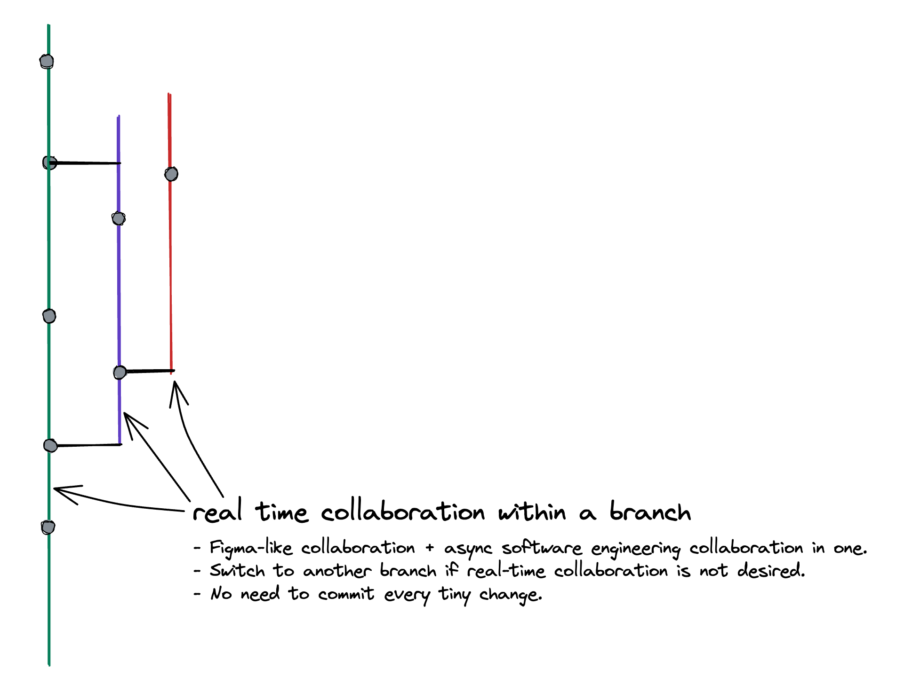

# RFC git sdk requirements

## Background

This RFC evaluates two architectures on building a git backend that serves current and foreseen needs of inlang.

The inlang editor currently uses the git JS implementation. The JS implementation lacks git features that are required to build out the editor. The lack of git features triggered the exploration of switching the underlying git implementation, see [https://github.com/opral/inlang/issues/278](https://github.com/opral/inlang/issues/278).

### Glossary

- **isomorphic git** -The JavaScript git implementation currently used in the inlang editor.
- **libgit2** - The git implementation that can be compiled to WebAssembly.
- **git-sdk** - Client side git implementation that takes over cloning a repository.
- **git-server** - Server that host git repositories. Think of GitHub.

## Goals

- Focus on iteration speed.
  - We deal with high uncertainty. The faster we can iterate, the better we can react to changing requirements.
- Focus on DX when using the SDK.
  - How easy can developers use the git backend? We intend to offer version control as a backend to external developers.
- The implementation must be de-coupled from inlang.
  - Inlang provides requirements that are _most likely_ universal across apps that build on git. But, the git-sdk should be de-coupled from inlang to enable developers to use the sdk to build own apps.

## Non-goals

- Architect the perfect system based on currently known requirements.
  - The requirements will change. We can’t architect the perfect system now.

## Requirements

### Not coupled to the browser [High Confidence]

The git-sdk must run on the server, in a Visual Studio Code extension (Sherlock), in CI/CD, in the browser. In short, everywhere.

The model to run the git-sdk everywhere is simple: have a filesystem. All environments except for the browser have a filesystem concept. Thus, we need to build a filesystem implementation for the browser.

### Must be git compatible [High Confidence]

The data in `.git` must be up to spec to ensure compatibility with the git ecosystem and ease adoption. The ecosystem includes GitHub, CLIs, etc.

### "Commands" like `clone` do not necessarily need to be up to spec [Medium Confidence]

Solving git limitations client-side, in the git-sdk, simplifies application architectures and is large part of inlang’s “the next git” thesis.

Problems we are running into are identical on both the server and client. For example, reducing the bandwidth/time to clone a repository: Moving git-sdk logic to the server only shifts the problem to the server, but doesn’t solve it. The client would need to wait for the server to finish cloning of the repositories. Instead, the git-sdk can be adjusted to support lazy loading of files and thereby automatically solve long cloning times client- and server side.

### Lazy loading of files and git history [High Confidence]

Oftentimes only a subset of files in git repositories are required. Only cloning files and their history that is needed substantially reduces network and storage requirements. A lazy loading solution is likely coupled with the filesystem implementation.

```jsx
/**
 * An example lazy loading implementation API.
 */

// does not clone the entire repository.
// only metadata that enable other git commands to run
await clone("https://github.com/opral/inlang", fs);

// lazy fetches the file and git commit history of README.md
const commitHistory = await history("/README.md", fs);

// lazy fetches xyz file
const readme = await fs.readFile("/xyz.md");
```

### Must be git compatible [High Confidence]

The data in `.git` must be up to spec to ensure compatibility with the git ecosystem and ease adoption. The ecosystem includes GitHub, CLIs, etc.

### "Commands" like `clone` do not necessarily need to be up to spec [Medium Confidence]

Changes in the `.git` subdirectory like commits must obey to the git spec but the “way to get there” e.g. commands like `clone` do not have to be up to spec. The git spec is designed for a CLI with access to a local filesystem, not an application that is running in the browser.

An interesting question arises how much of the git spec is required to operate an application like the inlang editor. A good example is `sparse checkout`. `sparse checkout` is a Git feature that enables a user to check out only a subset of files from a repository instead of the entire repository. Coming close to the lazy loading requirements of inlang? Not quite. `sparse checkout` required the knowledge of which files to load. The inlang editor has no knowledge of which files are required before cloning a repository. One might use `sparse checkout` to achieve lazy loading of files but the concept of sparse checkout could be eliminated all together if `clone` is lazy loaded by default.

```jsx
// DISCUSSION: What APIs are required?

// elementary
clone();
commit();
push();
pull();

// branch related
currentBranch();
createBranch();
renameBranch();
switchBranch();
deleteBranch();

// change related
// (3 API different "changes" concepts...)
unstagedChanges();
uncommittedChanges();
unpushedChanges();

// host like GitHub or GitLab dependent
signIn();
signOut();
createFork();
syncFork();
openPullRequest();
```

### (Future) File-based auth [High Confidence | Server-related ]

Supporting features like file-based auth will require a custom git server. Translators are not supposed to have access to the entire source code if they only use a few resource (translation) files. Discussion is ongoing in [https://github.com/opral/inlang/discussions/153](https:github.com/opral/inlang/discussions/153).

File-based auth seems to go hand-in-hand with “lazy cloning”. The server would only allow to clone files that the actor has access to.

### (Future) Real-time collaboration [High Confidence]

The editor requires real-time collaboration. We don’t know how we are going to implement real-time collaboration yet from both a technical and design standpoint. But how is easy could the git SDK be extended to add real-time-collaboration?



Having real-time collaboration in a branch combines Google Docs style collaboration with software engineering collaboration.

### (Future) Support for large files out of the box [Medium Confidence]

The git-sdk would need something like Git Large File Storage [https://git-lfs.com/](https://git-lfs.com/) built-in. Localization affects media files as well. Support for large files seems to go hand-in-hand with with lazy cloning i.e. the penalty of storing large files .

### (Future) Plugin system to support different files [Medium Confidence]

A plugin system could enable storing files like SQLite, Jupyter Notebooks, or binary files natively in git. If an SQLite file could be stored in git, inlang and other apps might not require dedicated servers to host data. See [https://github.com/opral/inlang/discussions/355](https:github.com/opral/inlang/discussions/355).

Storing certain files in git is problematic because git uses a diffing algorithm that is suited for text files (code) but unsuited for other file formats. Having a plugin system where plugins can define the diffing algorithm for different file formats like `.ipynb` or `.sqlite` could enable a variety of new use cases.

# A proposal for the Inlang git-sdk by @araknast

## Proposed Features

### Lazy loading

#### Motivation

It is clear that we need some sort of system in place avoid fetching objects
from the remote that we do not need. This is partially solved by using shallow
clones to avoid fetching history when we are only working on the tip of a
branch, but even here we are still fetching a significant number of files that
are not necessarily being used by the editor.

#### Implementation

To resolve this, we exploit the functionality behind partial clones, namely the
`filter` option to the `fetch-pack` wire command, and promisor pack files. We
then use this to implement a sort of 'partial fetch' which, when combined with
a pattern based sparse checkout has the effect of fetching only the objects
necessary to render the files we are using, and significantly speeding up the
cloning process.

#### Abstraction

To make this easier for the end user, we can expose this functionality as a
lazy loading filesystem which functions exactly the same as a normal
filesystem, except in its implementation of `readFile()`.

The only modification necessary to `readFile()` is a hook at the very beginning
which calls `checkout` on the current file before it is opened. Once promisor
packfiles are implemented, this will handle the fetching and unpacking of the
corresponding object in a way that is completely transparent to the end user.

### File Based Authentication

#### Motivation

When working with large teams, it is often not optimal or even secure for all
members to have access to the entire repository. For this reason we implement
file based authentication on the server side to prevent users from accessing
files for which they have not been granted permission.

#### Implementation

The simplest way to implement this while maintaining compatibility with Git is
to have a modified version of the Git server which allows users the option to
authenticate. Each object stored on the server is access controlled, and the
server will refuse to serve object to users who do not have permission, i.e.
those objects will not be included in the packfiles sent to the user.

#### Issues

First, users who are not aware of this system will receive what looks like a
corrupt repo when they attempt to clone a repo for which they do not have
permission to access all the objects. In order for this to work properly it is
necessary for the user to run a partial clone of only the files they have
access to (or use the lazy fs).

Second, because tree objects contain the name, mode and hash of
the files they reference, these attributes will be potentially visible to users
even if they don't have permission to access the file (if they have access to
the parent tree).

If this approach is taken, these issues should be made clear in the
documentation.

### Support for Different File Types

#### Motivation

The Git workflow is very well suited to collaboration, but is limited by the
fact that its most powerful tools only work with text files.

At its core, Git is simply a hash based key-value store. Git has notions of
hierarchical structure in the form of 'trees' and 'blobs', but it is only
because of our familiarity with POSIX style files systems that we associate
these with 'folders' and 'files' respectively. A 'tree' is simply an object
that is parent to one or more blobs or other trees.

Furthermore the 'lines' of a file are only relevant to Git as far as generating
diffs to present to the user, and the compression of packfiles. These 'lines'
simply represent the increments in which a blob is modified.

Take a SQL database for example. MySQL handles multiple databases, each of
which contains multiple tables. These tables then contain rows, which are the
increments in which they are written to. Then for MySQL, our 'trees' are
databases, our 'blobs' are tables, and our 'lines' are rows.

#### Implementation

All that is necessary for Git to manage these files is a hook when staging, to
convert the file to multiple Git objects, and a hook when checking out to
convert multiple Git objects back to their corresponding binary format. Similar
hooks exists in the form of the `clean` and `smudge` hooks, however these have
files as both their input and outputs. Our implementation would be more powerful
in that it would allow for 'cleaning' a file into multiple Git object, and
'smudging' multiple Git objects into a single file.

Finally, in order for the diffs between these binary files to be presentable to
the user, we will need allow the end user to define their own 'diff'
implementation to support various file types.

### Building on top of isomophic-git

There has been some discussion on whether we should continue using
isomorphic-git as our backend, or switch to a more performant WASM based backend
such as libgit2. I propose we continue using isomorphic-git as our backend. My
reasoning is as follows:

1. Portability, isomorphic-git runs everywhere JS runs. This would allow our
   git-sdk to run in environments that do not support WASM, such as React
   Native.
2. Extensibility, being written in JS allows us to _quickly_ extend isomorphic-git
   to add features and functionality as necessary. libgit2 on the other hand is
   written in c, and so even if we were to use language bindings we would need
   to work with the c codebase to extend the core git functionality (such
   as promisor packfiles).
3. Filesystem support, isomorphic-git provides a flexible plugin architecture
   for filesystem backends which can be accessed with a standard API. With libgit2
   we will need to write our own wrapper on top of an existing WASM filesystem
   solutions, and would be limited to the filesystem types they support.
4. Ease of development, as mentioned earlier isomorphic-git is written in JS,
   which means it is much easier to integrate with our existing JS codebase.
   Furthermore the the isomorphic-git codebase is far more modular than
   libgit2's, and being written in JS means we are able to easily extend and
   modify _any_ piece of it's code to work with our application, _not just
   those that are exposed by the api_.
5. We are already using isomorphic-git. This is no small point, switching from
   isomorphic-git to libgit2 would mean considerable downtime as we build an
   api on top of the new system. This is time which is taken away from
   development of new features in the git sdk, as well as the Inlang editor as
   a whole.

## Summary and Roadmap

To summarize, I propose git-sdk should implement the following features:

1. Standard Git commands for interacting with repositories
2. Lazy loading based on `fetch-pack` filtering and promisor packfiles
3. Lightweight file-based authentication built on top of the existing Git protocol
4. More powerful implementations of the `smudge` and `clean` hooks, as well diff
   providers to support version controlling diverse filetypes

While I propose we continue to use isomorphic-git when implementing this sdk,
most of its features will be built on top of existing Git functionality, so our
roadmap will look similar no matter which backend we go with.

For isomorphic-git, the roadmap will look something as follows (note the
difficulty assessments in square brackets):

1. Update isomorphic-git to support wire protocol v2 [medium]
2. Implement support for promisor packfiles in isomorphic-git [medium-hard (?)]
3. Implement partial cloning with a `filter` option to `git.clone` [easy]
4. Abstract partial cloning into a lazy fs that is transparent to the user (git-sdk is born) [easy]
5. Implement `smudge`, `clean`, and `diff` providers to support binary files [easy]
6. Create a custom server implementation for file based authentication [hard]

If using libgit2, the roadmap would look somewhat similar:

1. Implement support for promisor packfiles in libgit2 [hard]
2. Implement partial cloning with a `filter` option to `git.clone` [medium (?)]
3. Abstract partial cloning into a lazy fs that is transparent to the user (git-sdk is born) [easy]
4. Write `smudge`, and `clean` implementations for libgit2 which support
   multiple object input and output [hard (?)]
   - This could be made easier if we handle this in git-sdk in a way that is
     transparent to libgit2, but we lose the performance benefits
5. Create a custom server implementation for file based authentication [hard]

Note that [easy, medium, hard] denote the amount of work involved, not
necessarily the difficulty of the problem, that difficulty is based on the
assumption that the previous tasks have already been completed, and also that
difficulty assesments are my own soely based on my experience working with
the respecive codebases.

## Miscellaneous Notes

### Performance Issues in Isomorphic-git

The largest issue faced by the Inlang editor in its current iteration using
isomorphic-git is the time taken to clone large repositories. The cause of this
is twofold:

1. isomorphic-git is significantly slower in indexing packfiles sent from the
   remote than canonical git.
2. the implementation of `checkout` in isomorphic-git suffers from a lack of
   optimization in determining which files to update. Where canonical git
   evaluates the files in a single pass, isomorphic-git evaluates them in
   multiple passes causing considerable slowdown (see [this comment](https://github.com/isomorphic-git/isomorphic-git/issues/32#issuecomment-353920967)
   and the comments in
   [src/commands/checkout.js](https://github.com/isomorphic-git/isomorphic-git/blob/main/src/commands/checkout.js)).

With considerable effort, this could potentially be improved, but at the
moment it makes more sense to focus on optimizing the usage of our Git backed
(i.e. partial clones etc.) rather than the performance of the backend itself.

### Fork vs. Patch Workflow

Git-sdk should be designed to support both major Git workflows:
patch/send-email (Linux, git, sourcehut), as well as fork/PR (GitHub, GitLab,
Bitbucket). For this reason our sdk should also include functionality to
generate and apply patches, which can then be used in these workflows.

### Collaboration and Multi-User Editing

In my opinion this is best done on the frontend with something like Operational
Transform, not Git for performance reasons. Once the a files edits have been
resolved it can be committed normally to the repo (potentially noting the
multiple contributors).
