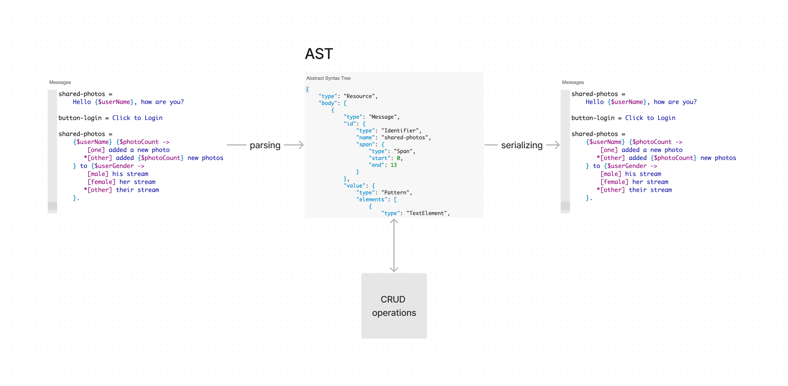

# @inlang/ast

The AST for `Resources` and `Messages`.

## What is the AST for?

Translations (Messages) are usually stored in a file (Resource). An [AST](https://en.wikipedia.org/wiki/Abstract_syntax_tree) is a machine-processable representation of a file (Resource) and contained
syntax (Messages). A parser creates (parses) the representation to an AST. A serializer reconstructs (serializes) a file from an AST.

The AST allows for CRUD (Create, Retrieve, Update, Delete) operations on a Resource and is therefore the fundamental building block for inlang applications such as the IDE extension or Editor.

## Design goals and choices

### Based on the newly planned industry-standard MessageFormat 2.0

Inlang strives to consolidate localization approaches and form best practices. Basing the AST on the newly specified and planned industry-standard MessageFormat 2.0 supports the consolidation goal.

The Unicode Consortium is working on a [new industry standard](https://github.com/unicode-org/message-format-wg) for representing localizable messages (strings). Instead of basing the AST
on the outdated but widely adopted MessageFormat 1.0 format, rolling our own syntax, or adopting a well-designed but niche syntax like [Fluent](https://projectfluent.org/), we decided to build on and support the planned industry-standard MessageFormat 2.0.

### Extending the MessageFormat 2.0 spec

At the beginning of development, the MessageFormat 2.0 spec was unfinished and contained no Metadata and Resource specifications. The AST, therefore, extends the MessageFormat spec where required.
